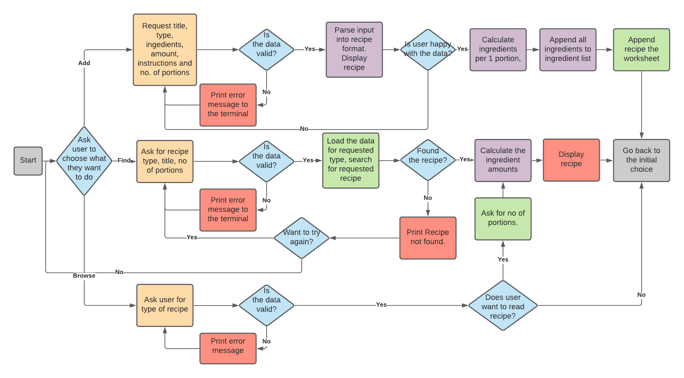
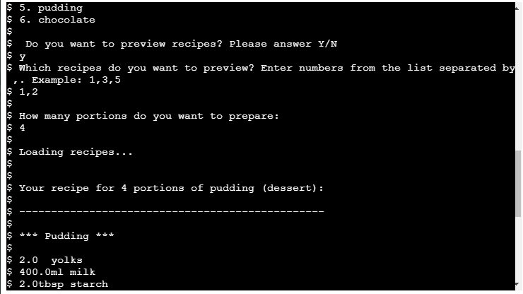

# Recipe book

Recipe Book is an data automation application for amateur and professional cooks enabling storing, browsing and rescaling essential recipes. The application pushes and pulls data from google sheets containing the recipe and recalculates the recipe proportions accordingly to demanded number of portions.

## Instructions

Please follow the instructions in the terminal to add recipe, find recipe by name or browse through recipes in the Recipe Book if you need an inspiration or do not remember recipe's name.

## UX

###  Rationale

Storing and accessing recipes is vital for work in the kitchen.

Easy scaling of the recipes according to the number of portions allows avoiding mistakes in the kitchen.

### Clients

Recipe Book is designed for both amateur and professional cooks who want to store and access their recipes digitally.

### User stories

* It happens to me very often that I attempt to do a double portion of a recipe and in the middle of the preparation forget to double the ingredients messing up the proportions. I need an easy way to scale up my recipes.

* I need to store my recipes and be able to access them without looking through many pages or a complicated search system.

* Sometimes I want to bake something but don't know precisely what that should be. I want to be able to browse some ideas within one category. 

### Design

Recipe Book is a command-line interface application and therefore has a limited design options. 

### Flowchart

A flowchart was created to visualize the planned functions within the application.

## Features

* Start screen

A ASCII graphics showing a pot and decorative title were chosen for the front page to create positive user experiance. After a short delay user is also offered a description of the application and guided through it by questions printed to the terminal. The delay was introduced to allow user seeing whole landing page before is pushed up.

* Add recipe

Add recipe allows adding new record to the Recipe Book. Program asks user to give the title, category, number of portions, ingredients (name, amount, unit) and instructions. The input is validated and user is asked to confirm the data before the entry is saved to google spreadsheet.

* Find recipe

Find recipe allows searching through selected category and request displaying a recipe with given name. If the name is misspelled or recipe is not found user can re-enter the recipe to ook for.

* Browse

The browse option allows to display list of recipes within a chosen category. User can choose between the recipes in the list and print them to the terminal.

### Future features

Future features could include:

* filtering recipies by publication date or ingredients

* adding more categories

* handle duplicated recipes

## Data Model

User input is structured with help of Recipe class. The class parse numeric data into intiger (portions) or float (amounts). 

The class contains methods to verify the data and parse it into strings and save by pushing into cells in google worksheet. The worksheet contains three spreadsheets named with corresponding category names.

## Testing

### Testing against user stories

* It happens to me very often that I attempt to do a double portion of a recipe and in the middle of the preparation forget to double the ingredients messing up the proportions. I need an easy way to scale up my recipes.

    * Program reads the recipe rescaled to according to the number of portions user declare.

* I need to store my recipes and be able to access them without looking through many pages or a complicated search system.

    * Applications offers the possibility to add a recipe as well to acces stored recipes. To read saved recipes user can search for recipe by name or browse all recipes within chosen category.

* Sometimes I want to bake something but don't know precisely what that should be. I want to be able to browse some ideas within one category. 

    *  The application allows user to browse recipes by displaying list of titles of the recipes to the terminal and allowing the user to selct recipes to be loaded.

### Validator testing [PEP8 requirements](http://pep8online.com/)

[x] too long lines and all were resolved
[x] trailing white spaces removed
[ ] trailing whitespaces in lines 442 and 443 were not removed to preserve proper display of the ASCII graphics

### Manual testing

All transitions between consecutive states were tested with respect to the state diagram.

[x] Dead-end end point were identified after executing selected function and when finding recipe was impossible. Problems were eliminated by returnig user to the initial choice of functions. 

[x] The application was tested against possible user input:

    *  expected input
    *  different font sizes
    *  special characters
    *  empty strings

    Were missing validation was added or improved.

[ ] Duplication of the recipes is possible. 

    Removing this possibility could be beneficial for future versions. In current version oldest (top in the spreadsheet) recipe will be displayed if requested within find function.

#### Encountered bugs

[x] Extra ';' character in ingredient list

    * Problem: Empty ingredient created upon loading the recipe due to ';' at the end of ingredient list. 
    * Solution: The last character is removed before saving the recipe.

[x] Program breaks when entering new choice at second attempt

    * Problem: 'verify_users_choice' is not defined error. The choice is not updated when new value is entered, as the returned is not returned to the value 
    * Solution: As it is the first input, simplest solution is to call the show_command() and restart the choice

[x] Program breaks at second attempt of entering new category within find function

    * Problem: validate_category takes new input but does not return the value
    * Solution: Return validate_category(category) from the validate_category after getting new input.

[x] Program breaks at second attempt of entering new recipe within find function

    * Problem: function takes new input but does not return the value
    * Solution: The function was re-writen, get_recipe(category) was returned from the look_for_recipe after getting new input.  

## Deployment

The site was deployed using Code Institute's mock terminal to Heroku. 

The steps to deploy are:

1. Add requirements for Heroku in the gitpod, commit and push to github.
2. Go to Heroku dashboard and click Add New App.
3. Select region: Europe and clicl set up app button.
4. Adjust settings in the settings tab:
* Create Config Var keys with value of the content of creds.json
* Add buildpacks by clicking on the add buildpack button and selecting heroku/python and heroku/nodejs follows by save buildpack.
5. Go to the deploy tab. Select Github as the diploy method. Select repository RecipeBook and click searach. Connect the repositiory with heroku.
6. Deploy manually to look through deploy logs.

The live link can be found here - [Recipe Book Page](https://recipe-book-by-joanna.herokuapp.com/)

The deployment of the page did not provide any errors.

## Credits 

* The ascii art comes from [asciiart.eu](https://www.asciiart.eu/)
* the ascii lettering from [fsymbols.com](https://fsymbols.com/text-art/)

